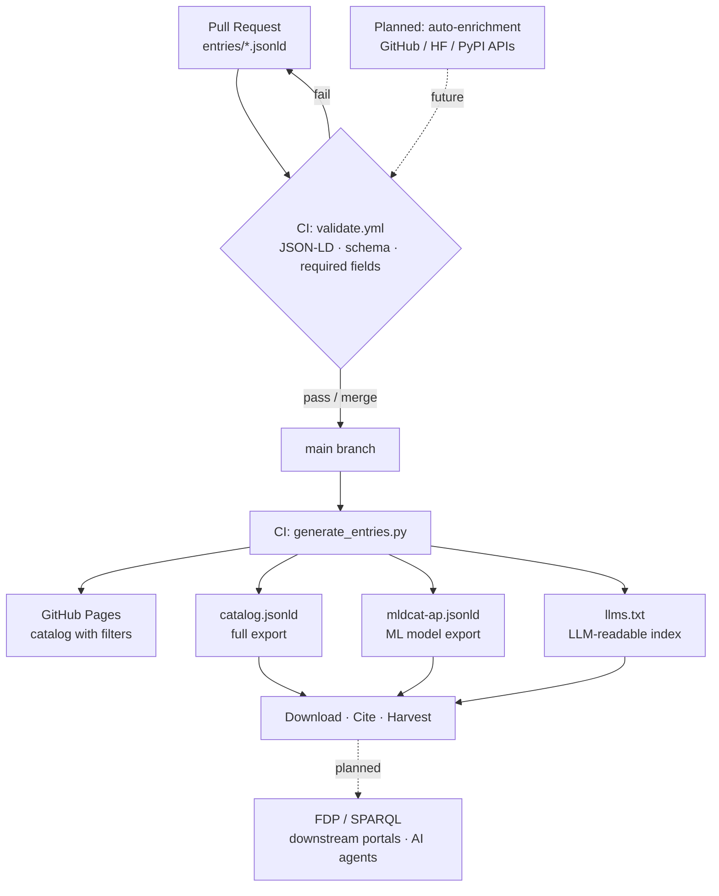

# MACH

**Machine-Actionable Catalog for Healthcare**

[](LICENSE)
[](LICENSE-DATA)
[](#)
[](https://github.com/FORSE-H/MACH/actions/workflows/validate.yml)

MACH is an open, machine-actionable catalog of open-source healthcare software, AI/ML models, clinical standards, datasets, tooling, and MCP servers - curated for humans, queryable by agents.

Every entry is a structured JSON-LD record aligned with established open metadata standards, so hospitals, researchers, governments, and AI agents can all discover and consume the open healthcare commons.

> **Project status:** seeding - initial entries and infrastructure being established.
> Initiated October 2025. A project of [FORSE-H](https://github.com/FORSE-H).

---

## Why MACH?

The open healthcare technology ecosystem is fragmented. EHR systems, FHIR servers, clinical AI models, medical imaging tools, ontology services, interoperability standards, and a fast-growing layer of MCP servers exist across hundreds of repos, blog posts, and Hugging Face filters - none of which is structured for agent discovery or aligned with open metadata standards.

MACH fills that gap with:

- **Structured, evidence-backed metadata** - every entry includes a curated rationale, clinical domain tags, deployment context, and at least one live evidence URL
- **Machine-readable exports** - MLDCAT-AP 3.0, CodeMeta 3.0, MCP `server.json`, Croissant, DCAT-AP
- **FAIR alignment** - stable entry URIs (w3id.org planned), versioned releases, DOI-archived on Zenodo
- **FAIR Data Point server** - planned RDF/SPARQL endpoint implementing the [FDP specification](https://specs.fairdatapoint.org/), making the catalog queryable by data portals, registries, and agents
- **Community curation** - all data lives in Git; contributions via pull request; CI validates every entry on push

---

## Who is MACH for?

| | |
|---|---|
| **Hospitals & health systems** | Evaluate open-source tools against structured criteria before procurement or deployment |
| **Researchers & data scientists** | Discover FAIR-aligned datasets, models, and pipelines with standardised metadata they can cite and query |
| **AI / agent developers** | Query the catalog programmatically via JSON-LD, llms.txt, MCP server, or SPARQL - no scraping required |
| **Governments & ministries** | Identify open standards-compliant tooling for national digital health infrastructure |

---

## Browse

| | |
|---|---|
| 🌐 Website | https://openmach.health *(coming soon)* |
| 📄 Full catalog (JSON-LD) | `/catalog.jsonld` *(generated on release)* |
| 🤖 For LLMs | `/llms.txt` *(generated on release)* |
| 📦 MLDCAT-AP export | `/mldcat-ap.jsonld` *(generated on release)* |
| 🔗 FAIR Data Point (RDF/SPARQL) | planned - implementing [specs.fairdatapoint.org](https://specs.fairdatapoint.org/) |

---

## Categories

| # | Category | Covers |
|---|---|---|
| 1 | **Clinical Systems** | EHR/EMR, HIS, PMS, telemedicine |
| 2 | **Interoperability Standards** | FHIR, HL7, openEHR, DICOM, IHE |
| 3 | **Terminologies & Ontologies** | SNOMED-CT, LOINC, ICD-11, RxNorm, HPO |
| 4 | **Data Models & Research Platforms** | OMOP CDM, i2b2, PCORnet, openEHR CKM |
| 5 | **Medical Imaging & Signals** | PACS, DICOM viewers, signal processing |
| 6 | **AI / ML Models** | Clinical LLMs, imaging models, NLP |
| 7 | **Datasets & Benchmarks** | MIMIC, PhysioNet, MedQA, MedMNIST |
| 8 | **De-identification & Privacy** | Philter, Presidio, openPseudonymiser |
| 9 | **Quality & Conformance** | FHIR validators, Inferno, test suites |
| 10 | **Public Health & Epi** | DHIS2, SORMAS, OpenSRP, Go.Data |
| 11 | **MCP Servers & AI Interfaces** | FHIR MCP, PubMed MCP, openFDA MCP |
| 12 | **Tooling & Infrastructure** | Terminology servers, pipeline tools |
| 13 | **Patient-Facing & mHealth** | Patient portals, wearable bridges |
| 14 | **Compliance & Governance** | HIPAA helpers, EU AI Act tooling |

---

## Metadata Standards

Each entry type serializes against the appropriate standard:

| Entry type | Primary standard | Also aligned with |
|---|---|---|
| Software / Tool | [CodeMeta 3.0](https://codemeta.github.io/) | schema.org SoftwareApplication |
| AI / ML Model | [MLDCAT-AP 3.0](https://semiceu.github.io/MLDCAT-AP/releases/3.0.0/) | Hugging Face Model Card |
| Dataset | [Croissant (MLCommons)](https://mlcommons.org/working-groups/data/croissant/) | schema.org Dataset |
| MCP Server | [MCP server.json](https://github.com/modelcontextprotocol/registry) | CodeMeta |
| Standard / Spec | schema.org + MACH vocabulary | DCAT-AP |
| The catalog itself | [DCAT-AP](https://semiceu.github.io/DCAT-AP/) | |

---

## Implementation status

The table above describes the *intended* alignment. Current implementation gaps:

| Standard | Status | Gap |
|---|---|---|
| [CodeMeta 3.0](https://codemeta.github.io/) | **Partial** - field names follow CodeMeta, `codemeta:` prefix declared in context | Export script (`scripts/export_codemeta.py`) not yet built; no per-entry `/codemeta/<slug>.json` output |
| [MLDCAT-AP 3.0](https://semiceu.github.io/MLDCAT-AP/releases/3.0.0/) | **Partial** - `mldcat:` prefix now declared; model fields resolve to `mldcat:` URIs | Export script (`scripts/export_mldcat_ap.py`) not yet built; no `/mldcat-ap.jsonld` output |
| [Croissant](https://mlcommons.org/working-groups/data/croissant/) | **Not started** - no dataset entries exist yet | Dataset entries, Croissant context mapping, and export script all pending |
| [MCP server.json](https://github.com/modelcontextprotocol/registry) | **Partial** - `mach:transport`, `mach:authMethod` etc. present in MCP entries | Export script producing compliant `/mcp/<slug>.server.json` not yet built |
| [DCAT-AP](https://semiceu.github.io/DCAT-AP/) | **Partial** - `dcat:` prefix declared in context | No DCAT-AP export; `dcat:` terms not yet used in individual entries |
| [Bitol ODPS](https://github.com/bitol-io/open-data-product-standard) | **Not started** | No data product entries or ODPS mapping |

All export generators are planned Phase 2 work.

**Planned Phase 3 features:**

- **AI-assisted catalog search** - natural language query interface over catalog entries; likely implemented as semantic search over entry embeddings or as an MCP server exposing MACH as an agent tool
- **Automated metadata enrichment on PR** - GitHub Action triggered when a new entry PR is opened; auto-fetches GitHub stars, last release date, license, and language from GitHub/HuggingFace/PyPI APIs and posts a pre-fill comment on the PR to reduce manual curator work

---

## How it works



---

## Contributing

All catalog data lives as JSON-LD files under `entries/`. Contributions are made via pull request.

**Quick start:**

```bash
git clone https://github.com/FORSE-H/MACH
cp entries/software/_template.jsonld entries/software/my-project.jsonld
# edit my-project.jsonld
# open a pull request
```

See [CONTRIBUTING.md](CONTRIBUTING.md) for the full guide, including the entry checklist and editorial judgement criteria.

---

## License

- **Code** (CI pipeline, adapters, site tooling): [Apache-2.0](LICENSE)
- **Catalog data** (all `entries/` JSON-LD files): [CC-BY-4.0](LICENSE-DATA)

Attribution: *MACH - Machine-Actionable Catalog for Healthcare, FORSE-H, https://github.com/FORSE-H/MACH*

---

## Cite this catalog

```bibtex
@misc{mach2025,
  title        = {MACH: Machine-Actionable Catalog for Healthcare},
  author       = {{Priyanka Ojha}},
  year         = {2026},
  url          = {https://github.com/FORSE-H/MACH},
  orcid        = {https://orcid.org/0000-0002-6844-6493},
  note         = {CC-BY-4.0}
}
```

---

## Acknowledgements

Inspired by [CNCF Landscape](https://landscape.cncf.io/), [Data Landscape (Entropy Data)](https://www.data-landscape.com/), [ThoughtWorks Tech Radar](https://www.thoughtworks.com/radar), [Research Software Directory](https://research-software-directory.org/) (Netherlands eScience Center), and [bio.tools](https://bio.tools/) (ELIXIR). Metadata standards: [MLDCAT-AP](https://semiceu.github.io/MLDCAT-AP/releases/3.0.0/) (SEMIC/EU), [CodeMeta](https://codemeta.github.io/), [DCAT-AP](https://semiceu.github.io/DCAT-AP/), [Croissant](https://mlcommons.org/working-groups/data/croissant/) (MLCommons), [Bitol ODPS](https://github.com/bitol-io/open-data-product-standard), [ODRL](https://www.w3.org/TR/odrl-model/) (W3C), [FAIR Data Point spec](https://specs.fairdatapoint.org/).
